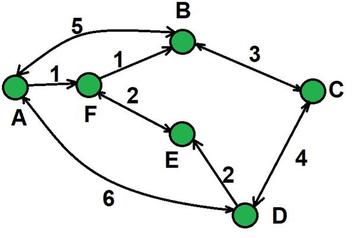

Создайте класс Город (City), которая будет представлять собой точку на карте со следующими характеристиками:

- Название Города: строка
- Набор путей к следующим городам, где путь представляет собой сочетание Города и стоимости поездки в него
- При создании Город требует указать название и можно (но не обязательно) указывать набор путей
- Город может возвращать текстовое представление, в виде названия Города и списка связанных с ним Городов (в виде пары: “название: стоимость”)
- Городу в любой момент можно добавить новый путь в другой город, указав либо сам путь, либо пару Город-цена
- Город должен иметь метод путешествия (travelBy). Такой метод принимает число n, который обозначает количество переходов. Проще говоря, в текущем списке путей берется первый город, из его списка путей так же берется первый город, из списка путей которого в свою очередь берется город и так далее до тех пор, пока либо количество городов не станет равным n, либо у текущего города не окажется путей. Метод возвращает последний Город пути или null если мы попали в тупик

Далее
необходимо методу путешествия объекта B передать некоторое число и вывести
возвращенный город на экран:

- Если передано число 1, результат должен быть либо A, либо С
- Если передано число 2, результат должен быть либо B, либо D, либо F
- Если передано число 3, результат может быть любом городом в зависимости от порядка следования путей в списках таковых у городов
- Настройте объекты городов так, чтобы при передаче числа 3 последним городом оказался город A